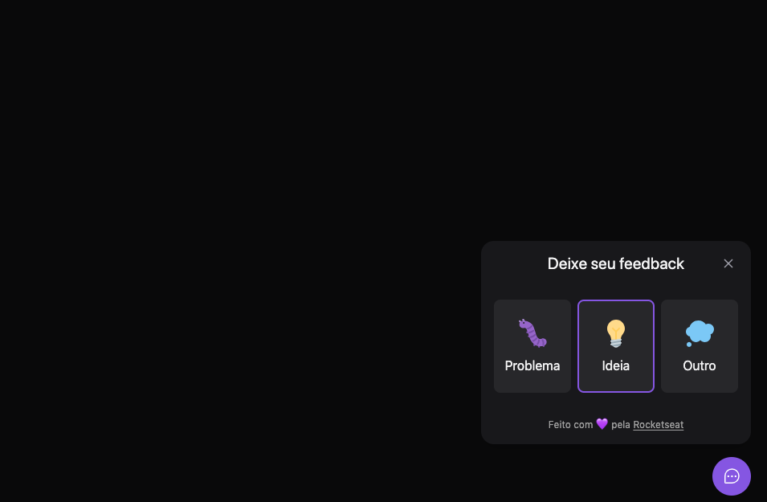

# Feedbacks Widget



Projeto web moderno construído com React, TypeScript, Vite e Tailwind CSS.

## 🚀 Tecnologias

- **React 19** - Biblioteca para construção de interfaces
- **TypeScript** - Superset JavaScript com tipagem estática
- **Vite** - Build tool e dev server ultrarrápido
- **Tailwind CSS 4** - Framework CSS utility-first
- **Phosphor Icons** - Biblioteca de ícones moderna e elegante

## 📦 Bibliotecas Principais

- `@headlessui/react` - Componentes UI acessíveis e não estilizados
- `html-to-image` - Conversão de elementos HTML para imagens
- `tailwind-scrollbar` - Estilização customizada de scrollbars
- `@tailwindcss/forms` - Estilos otimizados para formulários

## 🛠️ Pré-requisitos

- Node.js (versão 16 ou superior)
- npm, yarn ou pnpm

## 📥 Instalação

```bash
# Clone o repositório
git clone <https://github.com/vanessabrazuna/feedback-widget>

# Entre no diretório
cd web

# Instale as dependências
npm install
```

## 🎯 Scripts Disponíveis

```bash
# Inicia o servidor de desenvolvimento
npm run dev

# Cria a build de produção
npm run build

# Executa o linter
npm run lint

# Visualiza a build de produção
npm run preview
```

## 🔧 Desenvolvimento

Execute `npm run dev` para iniciar o servidor de desenvolvimento. A aplicação estará disponível em `http://localhost:5173`.

O servidor possui hot-reload automático, então as mudanças no código serão refletidas instantaneamente no navegador.

## 🏗️ Build

Execute `npm run build` para criar uma versão otimizada para produção. Os arquivos serão gerados na pasta `dist/`.

## 🎨 Estilização

O projeto utiliza Tailwind CSS 4 com suporte a:
- Utility classes customizadas
- Formulários estilizados via `@tailwindcss/forms`
- Scrollbars personalizadas via `tailwind-scrollbar`
- Sistema de design responsivo

## 📄 Licença

Este projeto é privado e não possui licença pública.

---

Desenvolvido com ❤️ Vanessa Brazuna